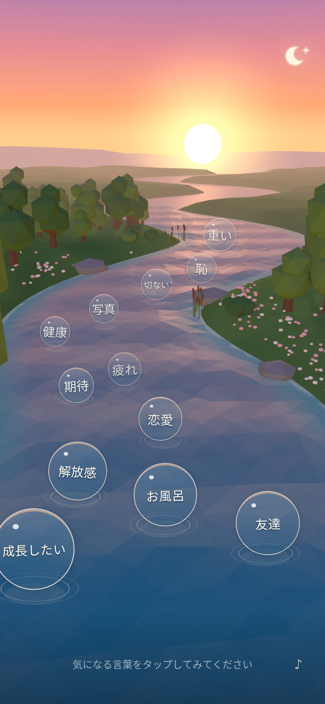
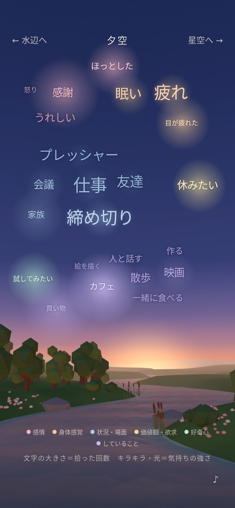
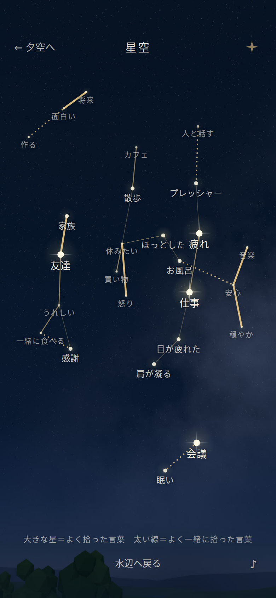
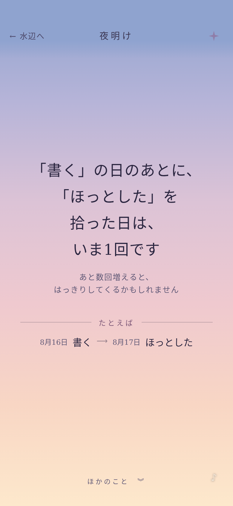
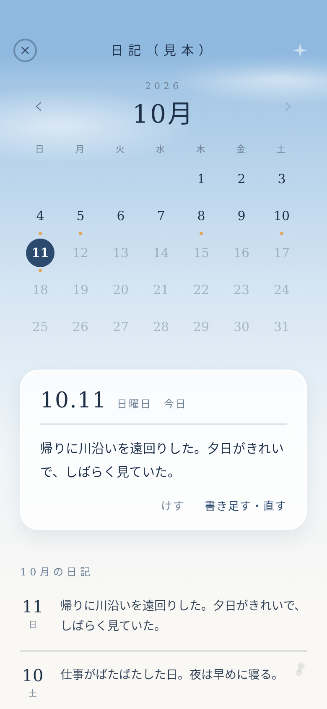

# pukapuka

**疲れている社会人が、30秒で言葉を拾うだけで、自分の好奇心の源に気づき、それが育っていくのが見えるアプリ。**

- 川を流れてくる言葉の泡を、ピンときたら拾うだけ。文字は打たなくていい
- 画面ごとに1つの問い・1つの分析。数字とグラフを出すのは「夜明け」だけ
- 育てる行動はアプリの外で、本人が選ぶ。アプリは気づきと育ちを映す鏡

## 画面

水辺で言葉を拾い、夕空・星空・夜明けで振り返り、日記に書く。夕方から夜、朝、昼へと、1日がひと回りするようにつながっています。
水辺の右上の「月と星」から、どの画面へも行けます。

<table>
  <tr>
    <td align="center" width="20%"><br><b>水辺</b>（夕方）</td>
    <td align="center" width="20%"><br><b>夕空</b></td>
    <td align="center" width="20%"><br><b>星空</b>（夜）</td>
    <td align="center" width="20%"><br><b>夜明け</b></td>
    <td align="center" width="20%"><br><b>日記</b>（昼）</td>
  </tr>
</table>

| 画面 | 何をする | 見えること |
|---|---|---|
| 水辺 | 川を流れてくる言葉の泡を、ピンときたら拾う。長く押すほど強い気持ち | （言葉を集める入口） |
| 夕空 | このごろ、何を拾っている？ | 拾った回数は文字の大きさ、気持ちの強さはキラキラと光 |
| 星空 | 何と何が、いつも一緒？ | よく一緒に拾う言葉が、線でつながって星座になる |
| 夜明け | 何のあとに、元気・好奇心が来る？ それは育っている？ | 「◯◯の日のあとに、△△を拾う」と、その回数。数字を出すのはこの画面だけ |
| 日記 | 自分で書くだけの場所。カレンダーで振り返る | 書いた日に小さな印。アプリは何もコメントしない（川とはつながらない） |

絵は、開発中のアプリ（web・見本のダミーの記録）の画面です。言葉や日記は仮のものです。
詳しくは [docs/SPEC.md](docs/SPEC.md)。絵を撮り直すときは、web を 8091 で立ててから `node docs/screens/render.mjs`。

## 開発に必要なもの

| 道具 | バージョン | 使うところ |
|---|---|---|
| Node.js | 24（`.nvmrc`。fnm なら `fnm use`） | アプリ本体（Expo） |
| uv | 最新 | 曲と効果音を作る Python の管理（Python 3.13 と numpy・scipy を `scripts/music/uv.lock` のとおりに自動で入れる） |
| ffmpeg | 6 以上 | 曲と効果音を m4a に書き出す |
| Blender | 5.2 | 背景の動画を作る |
| Expo Go | スマホに入れる | 実機での確認 |

### アプリを動かす（WSL）

```bash
npm ci
npx expo start --tunnel --clear   # スマホの Expo Go で QR を読む
```

`.env.local` に `EXPO_PUBLIC_CONVEX_URL` が必要です。

### 曲と効果音を作り直す

```bash
cd scripts/music
uv run build.py   # assets/sounds/ の bgm_*.m4a と chime_*.m4a を書き直す
uv run check.py   # 音割れ・音量・帯域・ループのつなぎ目を数値で確かめる
```

楽譜と楽器は `scripts/music/compose.py` にあります。作り方は `docs/SPEC.md` の「音」。
